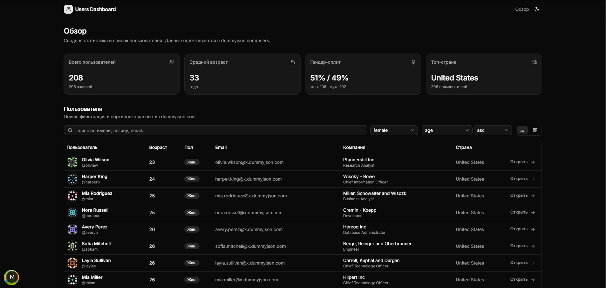
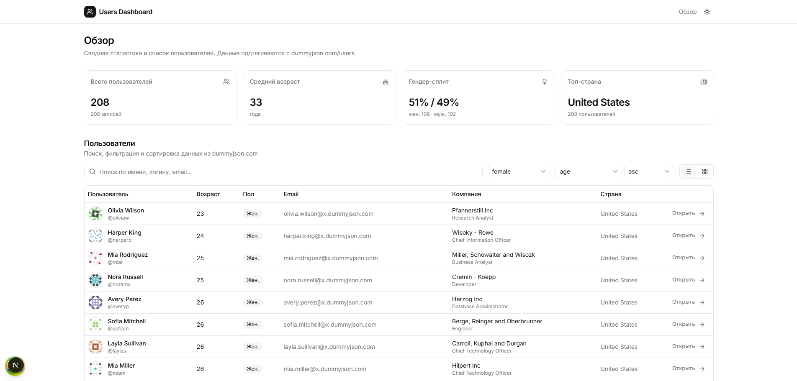
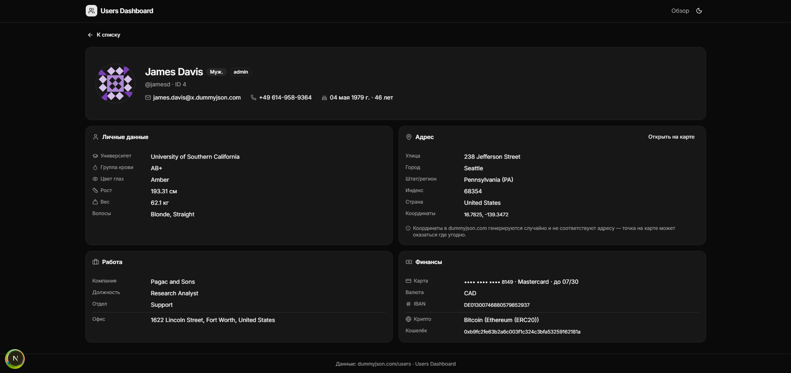

# Users Dashboard

Тестовое задание: дашборд со списком пользователей на базе публичного API [dummyjson.com/users](https://dummyjson.com/docs/users).

## Что делает приложение

**Главная (`/`)**

- **KPI-карточки:** всего пользователей, средний возраст, гендер-сплит, топ-страна. Для корректной статистики подтягиваются все записи (постранично, по 100 за раз).
- **Список пользователей:** поиск, фильтр по полу, сортировка (имя / фамилия / возраст / email / логин) с направлением, пагинация с выбором размера страницы (6/12/24/48), два вида — таблица и карточки. Все параметры хранятся в URL — ссылка делится и переживает перезагрузку.

**Страница пользователя (`/users/[id]`)**

- Шапка с аватаром, именем, ролью, полом, контактами (кликабельные `mailto:` и `tel:`).
- Четыре блока: личные данные, адрес (+ ссылка на OpenStreetMap по координатам), работа, финансы (номер карты замаскирован, оставлены последние 4 цифры).
- Отдельная страница `not-found` с переходом обратно.

**Прочее**

- Тёмная / светлая / системная тема (переключатель в шапке, `next-themes`).
- Адаптивная вёрстка, skeleton-состояния загрузки, понятные ошибки с кнопкой «Попробовать ещё раз».
- Доступность: ARIA-label на иконочных кнопках, семантическая таблица, focus-ring от shadcn.

## Стек и почему именно так

| Инструмент                  | Зачем                                                                                                                                                                                                                                                                                  |
| --------------------------- | -------------------------------------------------------------------------------------------------------------------------------------------------------------------------------------------------------------------------------------------------------------------------------------- |
| **Next.js 15 (App Router)** | Стандарт для React-приложений: маршрутизация из коробки, SSR/RSC, удобный dev-experience. Server Components для статичных частей (шапка, макет) + Client Components там, где нужен state.                                                                                              |
| **TypeScript**              | Требование задания + критично для работы с неочевидной формой `User` из внешнего API (адрес, банк, компания — всё вложенное).                                                                                                                                                          |
| **Tailwind CSS v4**         | Быстрая стилизация без переключения между файлами, единая дизайн-система через CSS-переменные. Тёмная тема через `.dark` класс — бесплатно.                                                                                                                                            |
| **shadcn/ui**               | Не библиотека, а набор компонентов, которые копируются в проект (`src/components/ui/*`). Под капотом — Base UI (headless-примитивы с правильной доступностью) + Tailwind. Выглядит профессионально из коробки, при этом всё можно править как свой код.                                |
| **TanStack Query**          | Кэширование запросов, `placeholderData: keepPreviousData` для плавной пагинации (старая страница не «прыгает» во время загрузки новой), дедупликация, devtools. Альтернатива — ручной `useEffect` + `fetch`, но это переизобретение колеса и пустые состояния загрузки на каждом шаге. |
| **next-themes**             | Стандарт для переключения темы в Next.js, корректно обрабатывает SSR / гидрацию.                                                                                                                                                                                                       |
| **lucide-react**            | Чистые SVG-иконки без лишних зависимостей.                                                                                                                                                                                                                                             |

Намеренно **не взяты**:

- Redux / Zustand — состояние UI живёт в URL (фильтры/сортировка/пагинация), серверное состояние — в TanStack Query. Отдельный store не нужен.
- Библиотека для таблиц (TanStack Table и т.п.) — колонки фиксированные, логика простая, отдельная библиотека — оверкилл.
- Библиотека графиков — dummyjson.com не даёт интересных временных рядов; KPI-карточек достаточно для обзорного дашборда.

## Структура проекта

```
src/
├── app/
│   ├── layout.tsx              # корневой макет, провайдеры, шапка
│   ├── page.tsx                # главная: KPI + список
│   ├── globals.css             # Tailwind + CSS-переменные темы shadcn
│   ├── error.tsx               # глобальный error boundary
│   ├── not-found.tsx           # 404 для неизвестных маршрутов
│   └── users/[id]/
│       ├── page.tsx            # серверная обёртка, распаковка params
│       └── not-found.tsx
├── components/
│   ├── ui/                     # сгенерированные shadcn-компоненты
│   ├── providers.tsx           # QueryClient + ThemeProvider (devtools только в dev)
│   ├── site-header.tsx
│   ├── theme-toggle.tsx        # переключатель темы (CSS-класс, без flicker)
│   ├── kpi-cards.tsx           # KPI + клиентская агрегация по всем юзерам
│   ├── users-section.tsx       # оркестратор фильтров, списка и пагинации
│   ├── users-toolbar.tsx       # поиск, фильтр, сортировка, переключатель вида
│   ├── users-table.tsx
│   ├── users-grid.tsx
│   ├── pagination.tsx
│   ├── user-detail.tsx         # оркестратор детальной страницы
│   └── user-detail/
│       ├── user-hero.tsx       # шапка с аватаром, бейджами, контактами
│       ├── personal-card.tsx   # личные данные
│       ├── address-card.tsx    # адрес + ссылка на OSM
│       ├── work-card.tsx       # компания / должность
│       ├── finance-card.tsx    # банк / крипто (маскированные)
│       ├── back-link.tsx
│       ├── section-card.tsx    # общий <SectionCard> + <Row>
│       └── user-detail-skeleton.tsx
└── lib/
    ├── types.ts                # типы User, UsersResponse, UsersQueryParams
    ├── api.ts                  # fetchUsers/fetchUserById/fetchAllUsers + ApiError
    ├── hooks.ts                # useUsers/useUser/useAllUsers (TanStack Query)
    ├── format.ts               # formatDate (ru-RU), pluralize, maskCardNumber
    ├── use-users-params.ts     # синхронизация состояния списка с URL
    ├── use-debounced-sync.ts   # debounce с двусторонней синхронизацией с URL
    └── utils.ts                # cn() от shadcn
```

## Ключевые решения

**Состояние — в URL, не в `useState`.** Фильтры, поиск, сортировка, страница, размер страницы, тип вида — всё живёт в query-параметрах. Преимущества: рабочие кнопки «назад/вперёд», расшариваемые ссылки (отправил коллеге `?q=emily&gender=female&sortBy=age&order=desc` — он видит ровно ту же выборку), SSR рендерит страницу с правильными данными с первого запроса.

**Поиск + фильтр — клиентская оркестровка разных эндпоинтов.** Dummyjson предоставляет три ручки: `/users`, `/users/search?q=…`, `/users/filter?key=gender&value=…`. Если есть `q` — идём на `search` и дофильтровываем пол на клиенте (search не знает про фильтры). Если есть только gender — на `filter`. Иначе — `/users`. Логика в [`src/lib/api.ts`](./src/lib/api.ts).

**Debounce поиска — 300 мс, локальный буфер.** Поле ввода хранит своё состояние, чтобы не дёргать URL и не перезапрашивать API на каждой нажатой клавише. При этом синхронизируется с URL при back/forward.

**Плавная пагинация через `keepPreviousData`.** При переходе на следующую страницу старые данные остаются на экране, сверху появляется «Обновляем…» — нет мигания.

**KPI считаются на клиенте.** API не даёт агрегатов, поэтому `fetchAllUsers` подтягивает всё постранично и статистика считается через `useMemo`. С учётом кэша TanStack Query (`staleTime: 5 мин`) — нагрузки нет.

**Маскирование карты.** Номер приходит открытым текстом; на UI показываются только последние 4 цифры. IBAN и кошелёк — полностью как идентификаторы. Замечание: в реальном продукте маскирование обязано выполняться на бэкенде, фронт не должен получать полный PAN — здесь так устроено только потому, что API тестовое.

**`ApiError` с HTTP-кодом.** Все запросы идут через общий `request()`, который оборачивает сетевые ошибки и не-2xx ответы в `ApiError` с полями `status` / `isNotFound` / `isServer` / `isNetwork`. Это позволяет:

- не ретраить 4xx (в `useUsers`/`useUser` настроена функция `retry`);
- показывать на детальной странице отдельный UI для 404 («Пользователь не найден») и для прочих ошибок («Не удалось загрузить»).

**Error boundary и not-found.** `src/app/error.tsx` ловит любые непойманные ошибки рендера и даёт кнопку «Повторить». `src/app/not-found.tsx` — глобальная 404 для неизвестных маршрутов. На `/users/[id]` 404 API-слоя обрабатывается прямо в компоненте, чтобы не терять BackLink.

**Devtools только в dev.** `@tanstack/react-query-devtools` грузится через `next/dynamic` и заглушается в prod — не попадает в клиентский бандл.

**Shadcn Button не поддерживает `asChild`** (эта версия использует Base UI). Для ссылок, стилизованных под кнопку, используется `buttonVariants()` на `<Link>` — это штатный паттерн shadcn/ui.

**Даты отформатированы по `ru-RU`** (`Intl.DateTimeFormat`). Плюрализация чисел — своя маленькая функция `pluralize(n, ['год','года','лет'])`.

## Запуск

Требования: Node.js ≥ 18 (проверено на 22), npm.

```bash
npm install
npm run dev
```

Открыть <http://localhost:3000>.

### Доступные скрипты

| Команда         | Назначение                              |
| --------------- | --------------------------------------- |
| `npm run dev`   | Dev-сервер на 3000 порту (Turbopack)    |
| `npm run build` | Production-сборка                       |
| `npm run start` | Запуск собранной версии                 |
| `npm run lint`  | ESLint (конфиг от `eslint-config-next`) |

## Скриншоты







## Что можно развить дальше

- Виртуализация таблицы на больших объёмах (сейчас на странице до 48 записей — не нужно).
- Пресеты отчётов (например, «женщины старше 30 из США») с сохранением в `localStorage`.
- Карта в детальной странице — встраивание Leaflet/Mapbox вместо ссылки на OSM.
- Тесты (Vitest для утилит `format.ts` / логики `api.ts`, Playwright для основных сценариев поиска и пагинации).
- Обработка мутаций (`PUT /users/:id`), если бы API их реально сохранял — dummyjson возвращает имитацию.
